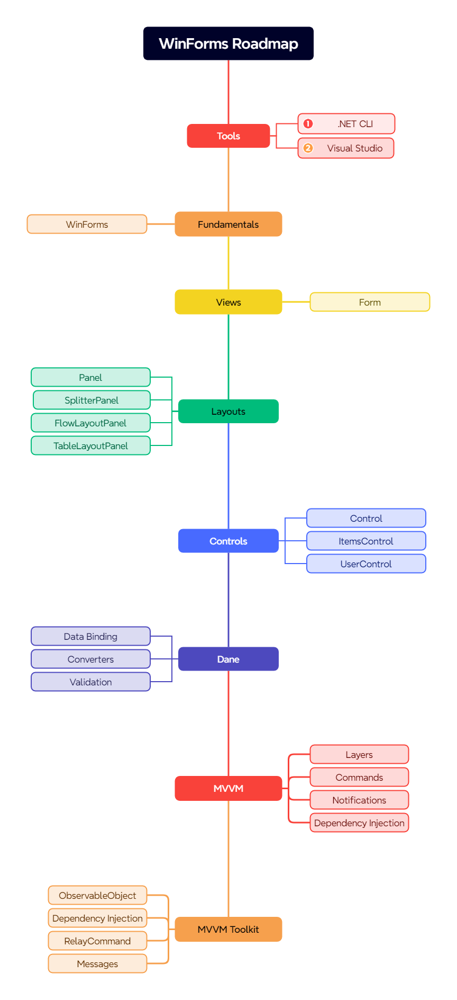

# Przykłady ze szkolenia

## Wprowadzenie

Witaj w repozytorium z materiałami do szkolenia **Tworzenie aplikacji Win Forms**.

Do rozpoczęcia tego kursu potrzebujesz następujących rzeczy:

1. [.NET 8 SDK](https://dotnet.microsoft.com/en-us/download/dotnet/8.0)

## Przygotowanie
1. Sklonuj repozytorium Git
```
git clone https://github.com/sulmar/sulmar-pip-winforms
```
2. Zbuduj
```
cd src
dotnet build
```

## Mapa drogowa

